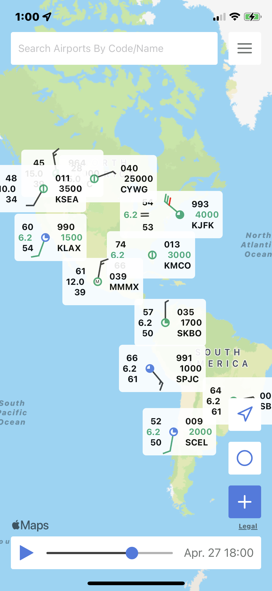
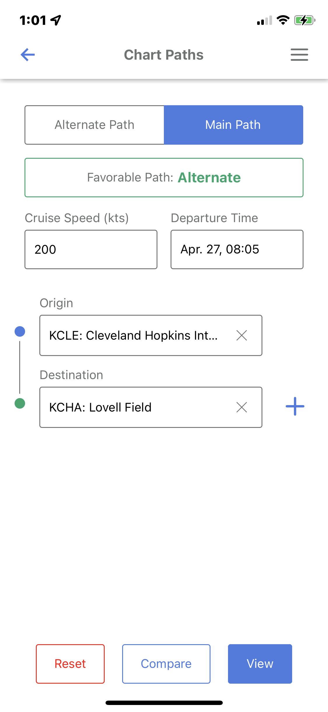
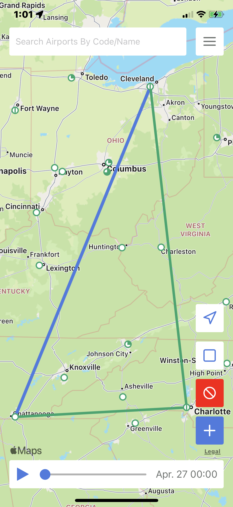
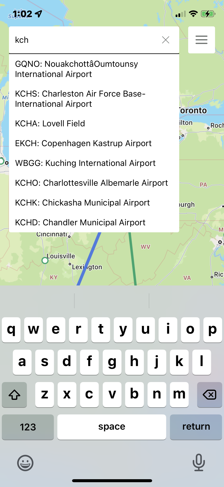

# Iter
A METAR Browsing &amp; Flight Charting Mobile Application.

Small business and private pilots do not have a
efficient and accessible method of viewing current and forecasted
METAR data alongside flight path planning based on that
weather data. The lack of this resource hinders a pilot’s capability
to plan the most efficient and safe flight. Iter fulfills this
desired need in the market. Features include graphical METAR
browsing, viewing of decoded METAR data, dual flight path
charting, and flight path comparison.

Supported on iOS and Android.

## Screenshots
<section>
    
    
    
    
</section>

## Flight Path Comparison Info
- Grading:
    - Assign point values to different criteria, greater in some areas.
    - Find grade by (points achieved / points possible) = 0.XXX value
    - Each Station gets a grade, averaged and compared. Higher value is better.
- Temp:
    - Points: 10
    - Above 35/40 C Not Good
- Dewpoint:
    - Points: 10
    - Smaller gap between temp and dewpoint is worse. Most thunderstorms happen above 21 C
- Wind Speed:
    - Points: 20
    - Lower better
- Wind Direction:
    - Points: 30
    - Tailwind Good, start from 90deg crosswind and add up.
- Wind Gust:
    - Points: 10
    - Lower or None Better
- Visibility:
    - Points: 10
    - Higher better, start grading at above 5 miles
- Sky Cover:
    - Points: 15
    - CLR > SKC > FEW > SCT > BKN > OVC > OVX
- Ceiling:
    - Points: 15
    - Grading Starting at 3000 ft AGl Ceiling and 5 miles Visibility
- Flight Category:
    - Points: 30
    - VFR > MVFR > IFR > LIFR
- WX String:
    - Points: 20
    - Grading Scale from PDf of Wx Strings
